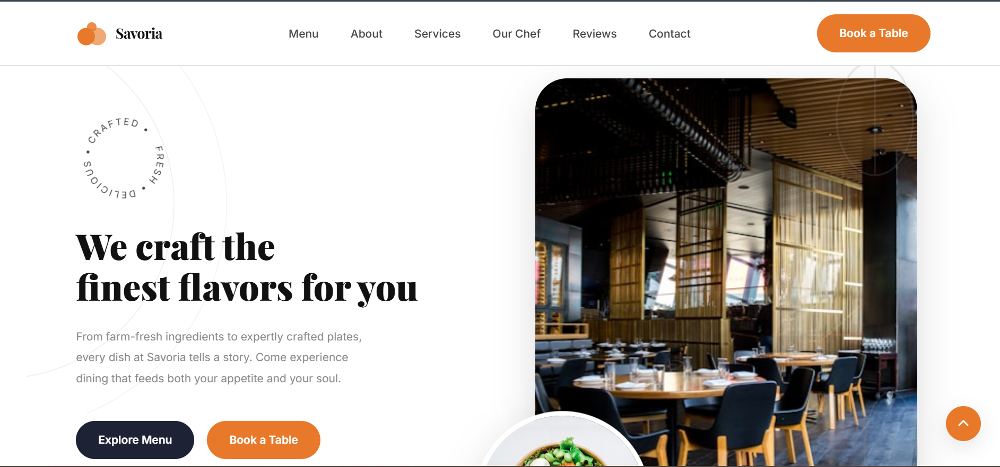
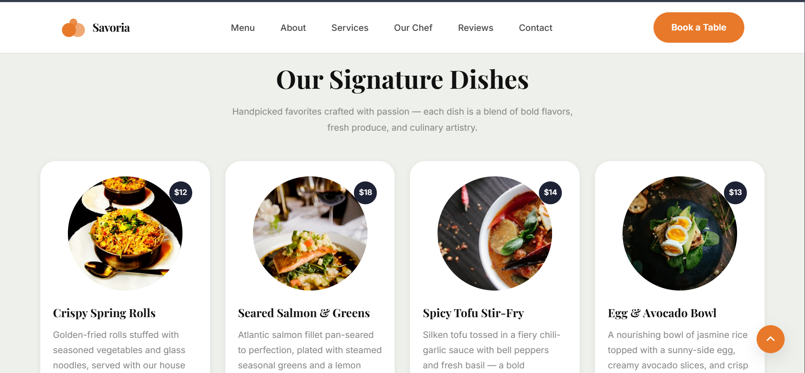
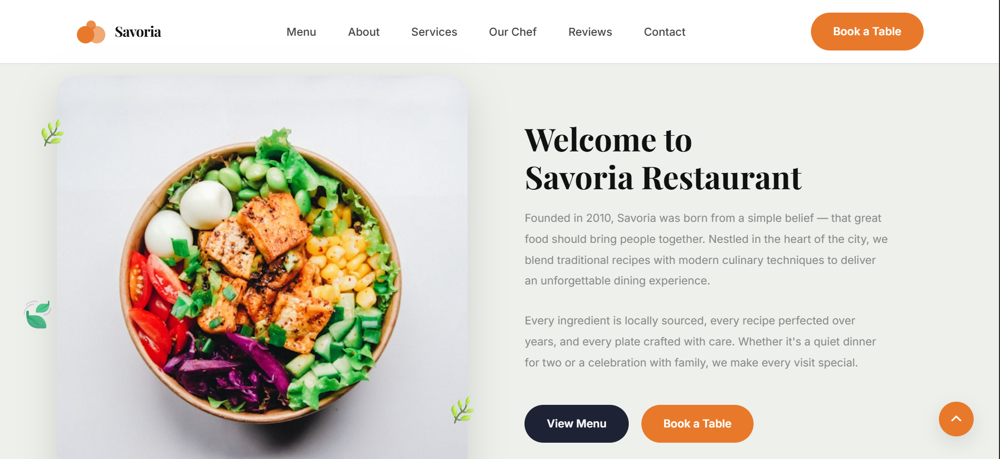
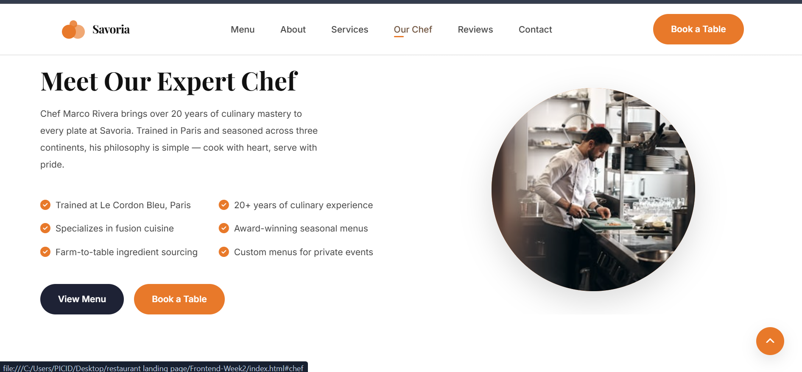
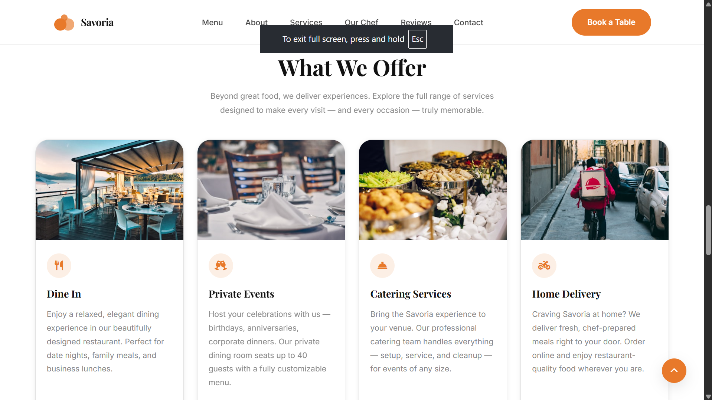
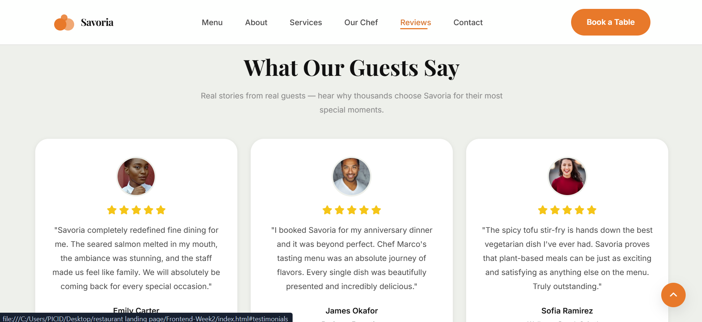
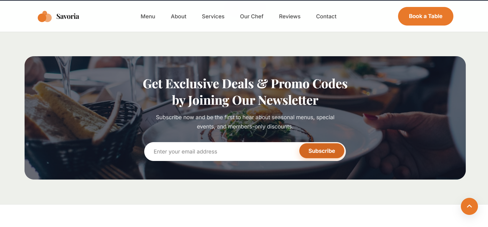
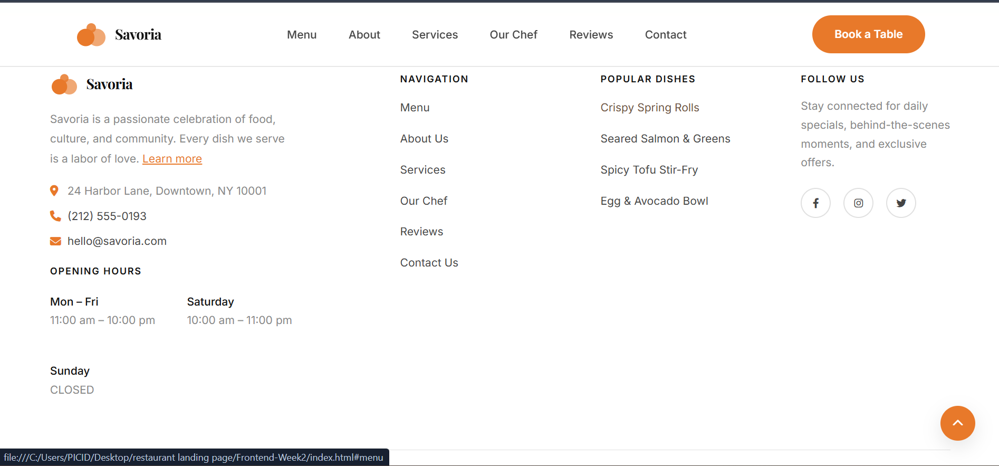

# 🍽️ Savoria — Fine Dining Restaurant Landing Page

A fully responsive restaurant landing page built with **HTML5** and **CSS3** only.
No Bootstrap, no Tailwind, no JavaScript frameworks — pure semantic HTML and custom CSS.

---

## 🚀 Live Demo

> [Add your live URL here after deploying to GitHub Pages / Netlify / Vercel]

---

## 📸 Screenshots

### 🖥️ Desktop View


---

### 📱 Mobile View

| Mobile View 1 | Mobile View 2 |
|:---:|:---:|
|  |  |
| *Portrait — Top Sections* | *Portrait — Bottom Sections* |

---

### 📄 Section-by-Section Preview

| | |
|:---:|:---:|
| <br/>**1. Hero Section** | <br/>**2. Signature Dishes** |
| <br/>**3. About / Welcome** | <br/>**4. Services** |
| <br/>**5. Guest Testimonials** | <br/>**6. Newsletter & Footer** |

---

## 📁 Folder Structure

```
Frontend-Week2/
├── index.html          ← Semantic HTML5 markup
├── css/
│   └── style.css       ← All styles (variables, layout, responsive)
├── images/             ← Local images (if replacing Unsplash URLs)
├── assets/             ← Additional assets
└── README.md           ← Project documentation
```

---

## ✅ All Required Sections

| # | Section | Content |
|---|---------|---------|
| 1 | **Header** | Sticky navbar — Savoria logo, 5 nav links, "Book a Table" CTA |
| 2 | **Hero** | Headline, description, dual CTA buttons, restaurant + food images, social icons, rotating badge |
| 3 | **Signature Dishes** | 4 dish cards with real names, descriptions, prices, and circular photos |
| 4 | **About** | Restaurant story, history, sourcing philosophy, dual CTA buttons |
| 5 | **Meet Our Chef** | Chef bio, 6 real specialty highlights in 2-col layout, chef portrait |
| 6 | **Guest Reviews** | 3 testimonial cards with real quotes, names, roles, star ratings |
| 7 | **Newsletter** | Email subscription form with real call-to-action copy |
| 8 | **Footer** | Logo, address, opening hours, navigation, dishes, social icons, copyright |

---

## 📐 Responsive Breakpoints

| Breakpoint | Target Device |
|------------|---------------|
| 1920px+ | Wide desktop |
| 1440px | Laptop |
| 1024px | Large tablet |
| 768px | Tablet |
| 480px | Mobile |
| 375px | Small mobile |

---

## 🎨 Design System

| Property | Value |
|----------|-------|
| Primary color | `#E8792A` (warm orange) |
| Dark color | `#1e2235` (deep navy) |
| Background | `#eef0eb` (light sage) |
| Heading font | Playfair Display (serif) |
| Body font | Inter (sans-serif) |

---

## ⚡ Bonus Features

- ✅ Smooth scrolling — `scroll-behavior: smooth` on `<html>`
- ✅ CSS animations — fade-in-up on page load, floating food image, spinning badge
- ✅ Sticky navigation bar — fixed header with backdrop blur effect
- ✅ Hover effects — cards lift on hover, buttons animate, nav links slide underline

---

## 🛠️ Tech Stack

- **HTML5** — semantic elements: `header`, `nav`, `main`, `section`, `article`, `footer`, `address`, `blockquote`
- **CSS3** — Flexbox, CSS Grid, Custom Properties (variables), Animations, Media Queries
- **Google Fonts** — Playfair Display, Inter
- **Font Awesome 6** — icons

---

## 📋 Run Locally

1. Clone the repo:
   ```bash
   git clone https://github.com/YOUR_USERNAME/savoria-restaurant.git
   ```
2. Open `Frontend-Week2/index.html` directly in your browser — no build step needed.

---

## 🌐 Deploy to GitHub Pages

1. Push to a public GitHub repository.
2. Go to **Settings → Pages → Source → main branch → / (root)**.
3. Your site will be live at `https://YOUR_USERNAME.github.io/REPO_NAME/Frontend-Week2/`.

---

## ✍️ Author

**Your Name**  
Frontend Development Intern — Week 2  
&copy; 2024 Savoria Restaurant
